CTF url is given, Let's see what is there\...

## Challange 1:

The name of the challange was **GEO**, One URL was provided and we need to find the flag.


While Intercepting the request in burp and observing the request, I found XML data passing inside one parameter. Also observed the it is **geoserver** so I searched for some geoserver related vulnerabilities on google and github and found one exploit.

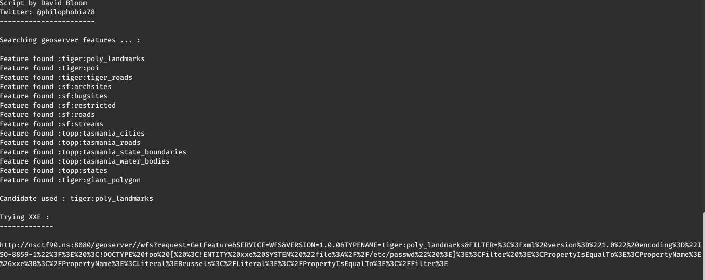

Using above script I have created one payload to read **/etc/passwd** and and used it inside the request parameter and :boom: we got content of /etc/passwd.

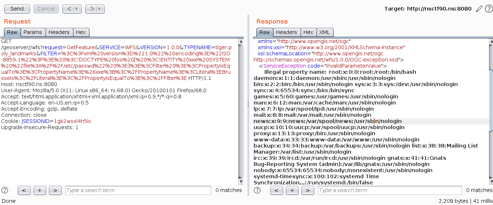

Observing the /etc/passwd I found there is one **nsctf** user, so next in the payload I have added **/home/nsctf** and observed that there is one file **\_\_flag1\_\_**.

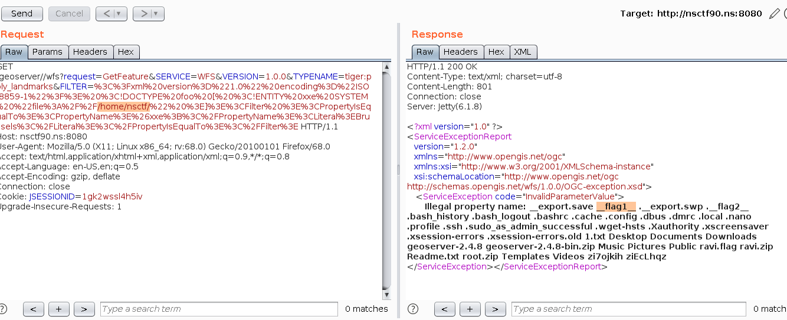

In the next payload we are reading the file using **/home/nsctf/\_\_flag1\_\_** and :boom: we got our first flag.

*flag was : nsctf{XX3_i5_aw3s0m3}*

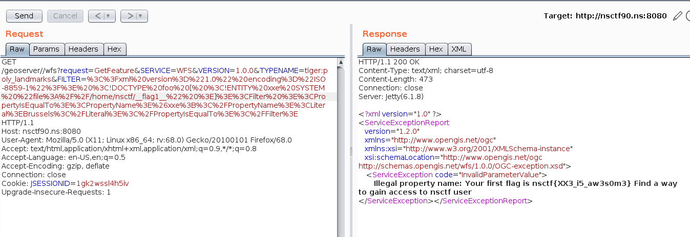


## Challange 2:

We need find a way to get access to nsctf user.

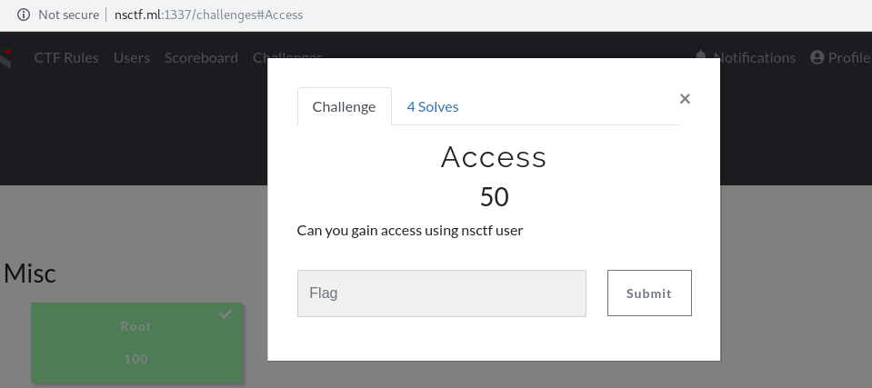

Previously we have observed that SSH was open, and as we able to read any system file of nsctf user, I tried to read **/home/nsctf/.ssh/id_rsa** and got nsctf user's ssh key.

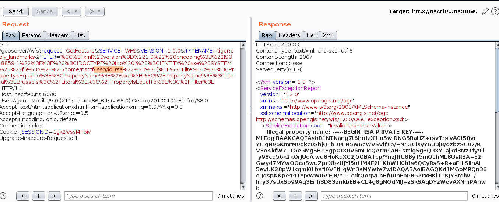

Using which we able to do ssh to nsctf user and read **.\_\_flag2\_\_** file.

*flag2 was: nsctf{4d9827f4f06f50d4618c6da61b68634c}*

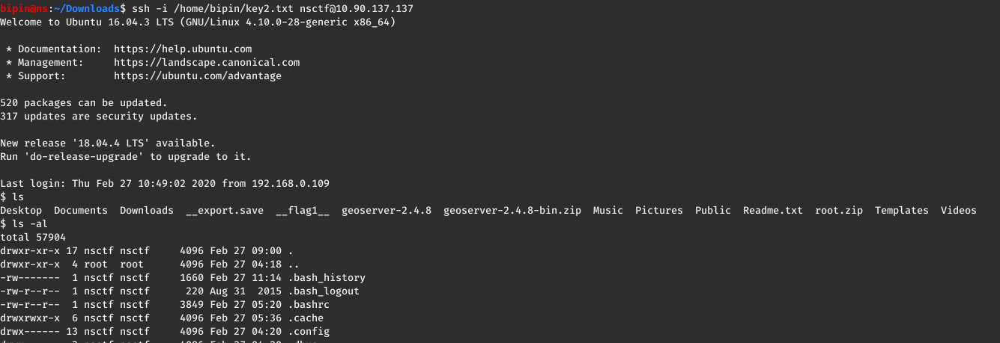
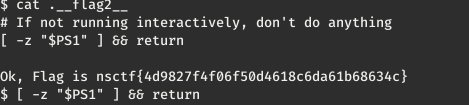

## Challange 3:

Can you become root?

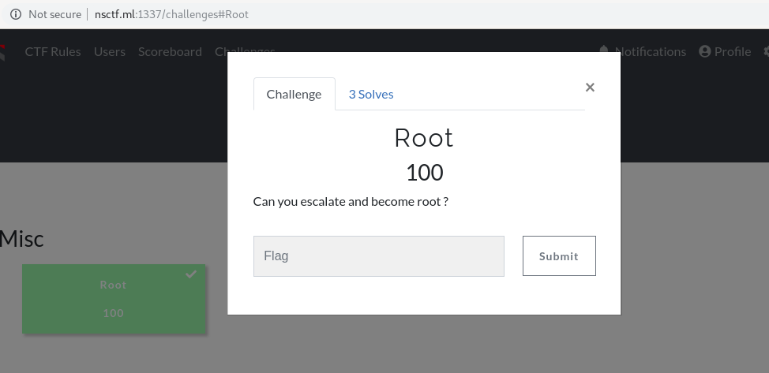

First step I done was running command **sudo -l** and observed that we can run zip command as a sudo. so tried below commands:

```
 echo "/bin/sh" > /tmp/win.sh
 sudo zip z.zip * -T -TT /tmp/win.sh 
```

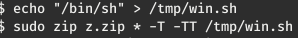

and we read **.\_\_root\_flag\_\_** file.

*flag was: nsctf{574ca321d4b0f3cca3d6763567095b17}*

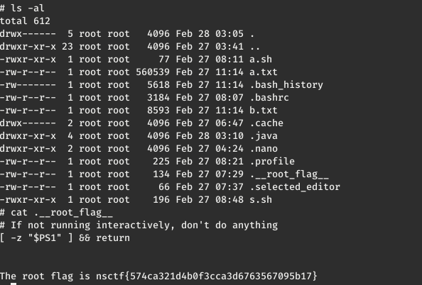
